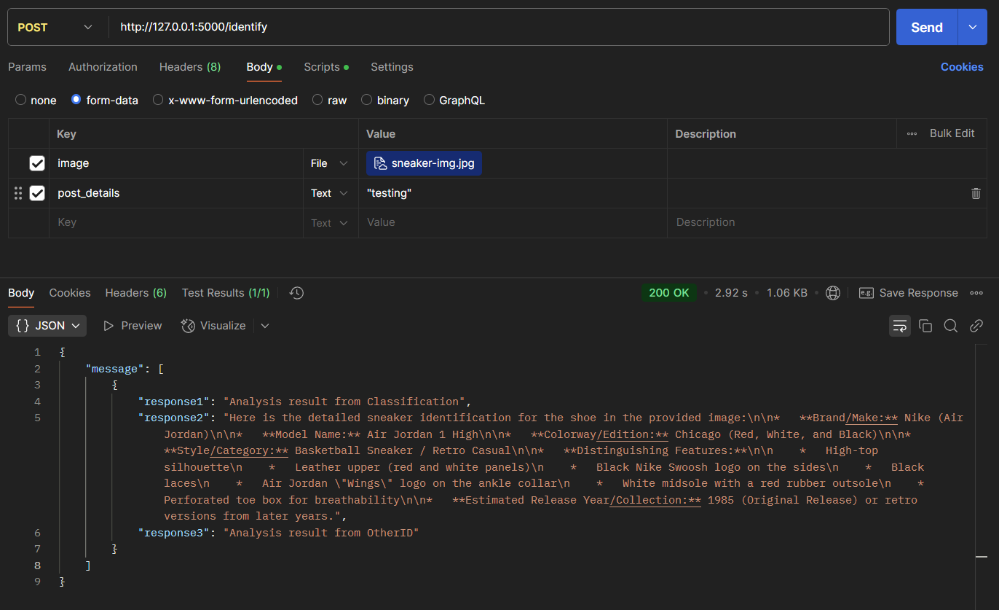

## Usage (WSL)

Make virtual environment:
```angular2html
python3 -m venv .venv
source .venv/bin/activate
pip install -r requirements.txt
```
- Must create a .env file add API_KEY=\<google genai key\> from the following link: https://aistudio.google.com/app/apikey

Running backend:
```angular2html
python3 app.py
```

Testing:
- send a post request to http://127.0.0.1:5000/identify, the post request should include a body with form data as the following: image of type file and post_details of type text

Image used:


Response:
